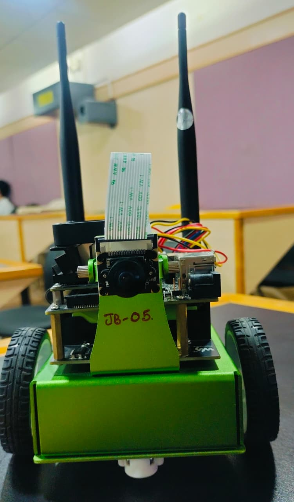
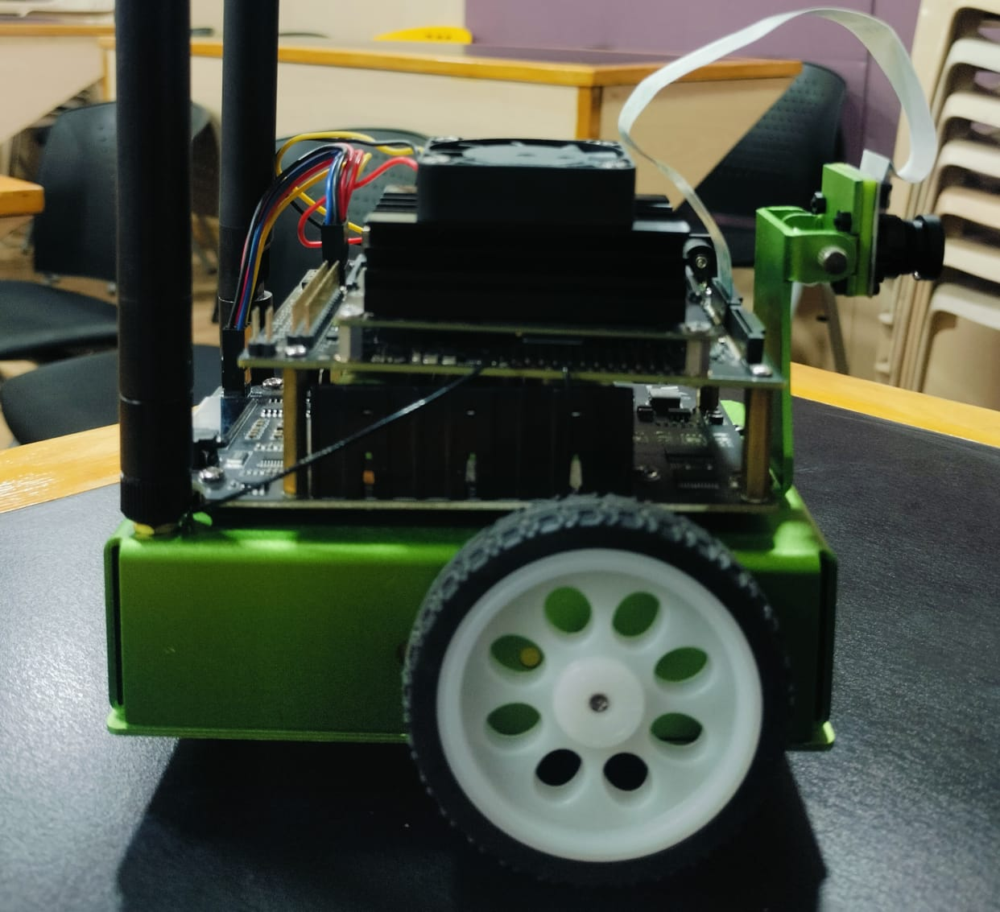

# NVIDIA-Jetson-Nano-JetBot
This project documents the development of an autonomous robot using the NVIDIA Jetson Nano and the JetBot platform. The robot is capable of various tasks, including basic motion control, collision avoidance, object following, and road following, all powered by a compact, powerful embedded system.

I designed and tested AI-based object detection models for this project. My role involved implementing real-time road tracking, autopilot mode, and obstacle avoidance, enabling autonomous navigation in controlled environments. This work included the crucial steps of model training, hardware integration, and testing of the complete autonomous driving system.

---

## 📸 Project Showcase

Here are some images and a video demonstrating the JetBot in action.

### Front View
<p align="center">
  
</p>

### Top View
<p align="center">
  
</p>

### Side View
<p align="center">
  
</p>

### Demonstration Video
<p align="center">
  <video src="Images/Video.mp4" controls width="600"></video>
</p>

---

## 🤖 Features

* **Basic Motion:** Control the robot's movement (forward, backward, turn) via a remote interface.
* **Collision Avoidance:** Utilizes a sensor (e.g., ultrasonic or camera) to detect and autonomously avoid obstacles in its path.
* **Object Following:** The robot can identify and follow a specific object using computer vision.
* **Road Following:** The robot is trained to follow a designated line or path.

---

## 🚀 Getting Started

1.  **Clone the repository:**
    ```bash
    git clone [https://github.com/vijaymeena1588/NVIDIA-Jetson-Nano-JetBot.git](https://github.com/vijaymeena1588/NVIDIA-Jetson-Nano-JetBot.git)
    ```
2.  **Navigate to the project directory:**
    ```bash
    cd NVIDIA-Jetson-Nano-JetBot
    ```
3.  **Follow the instructions in the individual subdirectories** (`Basic motion`, `Collision Avoidance`, etc.) to run each example.
